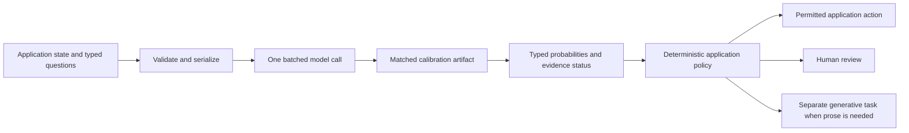

# Independent engineering review and implementation blueprint for RLCD

Author: ChatGPT 6 Astra

Creation timestamp: September 17, 2026, at 04:15:28 IST (`2026-09-17T04:15:28+05:30`, Asia/Kolkata).

Status: Independent source review and proposed implementation blueprint. No RLCD weights, SDK, browser export, or latency benchmark is produced by this review.

## 1. Review verdict and evidence boundary

You can build a useful decision SDK from this direction. Keep the typed interface, bidirectional classification, explicit abstention, deterministic policy, and public calibration evaluation. Replace the unsupported performance promises, the cardinality temperature formula, and the assumption that a custom GLiClass checkpoint loads and exports as an ordinary sequence classifier.

The first release should be a calibrated classifier for a declared evaluation population. Supervised cross-entropy plus Brier loss does not establish a reproduction of TypeSafe's proprietary reinforcement learning algorithm, a new foundation model, or calibration on arbitrary user schemas. Retain RLCD-demo as the project name and describe the actual training method in the model card. TypeSafe names RLCD publicly, but its launch description does not disclose enough of the training algorithm to reproduce it. [TypeSafe launch](https://typesafe.ai/blog/introducing-system-one-models-and-jev).

I read `AGENTS.md` and documents `00` through `07` in the requested order. The reviewed `07-ENGINEERING-IMPLEMENTATION-PLAN.md` has SHA-256 `35ef23df585da9e4de7d84af30269d6912d1a1f95bce4451f47bc2316d2817b3`. I also inspected the local OpenJev direct adapter and method notes. The workspace root contains research documents and reference implementations under `open-jev/`; the proposed root `core/` and `webgpu-demo/` are future work. The root is not a Git checkout in this environment, so this review identifies its input by file digest.

Use these evidence categories throughout implementation:

| Category | What you can conclude |
| --- | --- |
| Source verified | A cited configuration, weight header, implementation, or public methodology supports the claim. |
| Derived | Arithmetic or a mathematical argument follows from stated assumptions. |
| Locally checked | A check ran during this review, with its limited scope stated. |
| Proposed | An interface, experiment, or release criterion still requires implementation. |
| Unverified | You cannot use the statement as a release claim. |

### Peer review of Gemini Flash 3.8

| Topic in document 07 | Verdict | Replacement or improvement |
| --- | --- | --- |
| Typed decisions and ordinary code controlling policy | Agree | Preserve the boundary. Type validity does not imply semantic correctness. |
| ModernBERT and GLiClass as a starting point | Agree with conditions | Use the complete checkpoint, tokenizer, processor, and trained scoring head together. Establish a frozen baseline first. |
| 139M backbone plus 10M embeddings | Replace | The encoder has 149,014,272 parameters, including 38,682,624 token-embedding parameters. |
| Global layers numbered 2, 5, 8, and so on | Replace | The implementation uses zero-based global layers 0, 3, 6, 9, 12, 15, 18, and 21. |
| Full document-to-label attention in all 22 layers | Replace | Global layers connect the full sequence; local layers restrict direct attention. Information can propagate across layers. |
| ModernBERT's window explains Jev's invoice gap | Reject | Jev's architecture is undisclosed. The benchmark cannot identify that cause. |
| Table compactor enforces 120-token chunks | Replace | The sample code never uses its token limit, repeats the complete header only once, truncates mismatched rows through `zip`, and drops blank cells. |
| Single-token causal adapter | Improve | Require unique IDs, exact decoding, and prefix-preserving tokenization of the complete rendered prompt plus every answer slot. |
| Fixed cardinality temperature multiplier | Reject | It increases temperature and flattens the distribution. Fit a positive calibrator on representative held-out data. |
| CE plus Brier | Agree with qualifications | Both losses are strictly proper. Choose normalization explicitly and test the mixture; finite training gives no universal calibration guarantee. |
| Equal-mass ECE and ECE below 4% | Improve | Report sample counts, bin boundaries, uncertainty, Brier, NLL, and risk versus coverage. A single ECE threshold is insufficient. |
| Exactly two DAG passes, below 5 ms | Replace | A staged graph requires as many sequential rounds as its longest dependency chain, with additional calls if batches do not fit. |
| Eager export and a 48 MB INT8 browser model | Replace | Export the actual custom graph, verify its attention masks and browser operators, measure artifact size, and recalibrate the deployed artifact. |
| Lexical overlap filter guarantees decontamination | Reject | It misses template and semantic leakage, removes legitimate evidence, and creates a shifted training distribution. Split by source, template, and task family. |

## 2. Correct the architecture and performance facts

### ModernBERT parameter count and attention

The published ModernBERT-base configuration specifies 22 layers, hidden width 768, MLP intermediate width 1,152, 12 attention heads, vocabulary size 50,368, an 8,192-token maximum sequence, local attention setting 128, and global attention every three layers. Pin the inspected checkpoint revision `8949b909ec900327062f0ebf497f51aef5e6f0c8`. [Pinned configuration](https://huggingface.co/answerdotai/ModernBERT-base/blob/8949b909ec900327062f0ebf497f51aef5e6f0c8/config.json).

I read the Safetensors header without downloading the weight tensor payload. It contains 149,655,232 stored parameters: 149,014,272 in `model.*`, plus 640,960 in the masked-language-model head and decoder bias. The decoder weight is tied to the token embedding. Count unique parameters when you instantiate the decision model; removing its language-model head changes the total. [Checkpoint files](https://huggingface.co/answerdotai/ModernBERT-base/tree/8949b909ec900327062f0ebf497f51aef5e6f0c8).

The encoder count can also be derived from its tensor shapes:

$$
P_{\mathrm{encoder}}
= 50{,}368(768)
+ 22\left[4(768)^2 + 3(768)(1{,}152)\right]
+ 45(768)
=149{,}014{,}272.
$$

The first term is the token embedding, the second covers attention and gated MLP matrices, and the last covers normalization weights. Embeddings are already included, and account for about 38.7M parameters. The 139M figure in documents 02 through 07 is incorrect for this checkpoint.

At a local layer, the implementation uses a half-window of 64 on either side. With inclusive endpoints, an interior query can see 129 positions including itself. Treat `local_attention=128` as the configuration convention; verify the effective mask in each exported backend. Global layers use unrestricted bidirectional attention over valid tokens. Two successive local layers can expand a token's dependency paths by up to 128 positions in each direction, while a global layer makes sequence-wide information available. Neither direct visibility nor an expanded dependency path proves that the model understands a distant table cell. [ModernBERT implementation](https://github.com/huggingface/transformers/blob/v4.48.0/src/transformers/models/modernbert/modeling_modernbert.py).

The global layer test starts at layer zero. Local versus global describes the mask, not a mandatory assignment of FlashAttention-2 to one and FlashAttention-3 to the other. Runtime and hardware determine the attention kernel. BERT and RoBERTa use learned absolute position embeddings, so the plan's description of them as static sinusoidal embeddings also needs correction. [ModernBERT paper](https://arxiv.org/abs/2412.13663), [BERT paper](https://arxiv.org/abs/1810.04805).

### Memory, export size, and latency

For the 149,014,272-parameter encoder, raw weight storage is approximately 596.1 MB at FP32, 298.0 MB at FP16, 149.0 MB at eight bits, or 74.5 MB at four bits. These are decimal payload estimates. The decision head, quantization scales, unquantized tensors, graph metadata, and tokenizer add storage. Download compression and runtime memory are separate measurements. A 48 MB INT8 bundle is incompatible with storing every parameter of this encoder at eight bits.

A training layout with two-byte weights, two-byte gradients, four-byte master weights, and two four-byte Adam moments consumes 16 bytes per parameter, about 2.38 GB, before activations, attention buffers, temporary allocations, and framework overhead. Different precision and optimizer layouts change this figure. Documents 04 and 06 cannot establish a universal 2.5 GB training footprint. Measure peak allocated and reserved memory for the actual batch and sequence length.

An eager export can materialize expensive attention tensors. A single dense FP32 attention-score tensor with one example, 12 heads, and 8,192 tokens contains about 3.22 GB of data. A browser profile should therefore start with a much shorter measured token budget. Native support for 8,192 tokens does not imply that the exported WebGPU graph can afford that workload.

| Claim in the source documents | Review disposition |
| --- | --- |
| 0.8 ms on Apple Silicon and 0.2 ms on A100 | Unverified: no reproducible model, shape, precision, synchronization, or timing boundary accompanies these figures. |
| CPU 8 to 14 ms, GPU below 3 ms, or two passes below 5 ms | Unverified for the proposed GLiClass graph. Batch size, input length, and number of fields materially change work. |
| M4 below 15 ms | Keep as a proposed benchmark target for a named workload, not a current property. |
| Browser classification below 10 ms | Keep as a stretch target for warm inference on a declared device and short input. Display the measured result even when it misses the target. |
| JSON LLM generation takes 120 to 450 ms | Measure the chosen baseline. Output length, hardware, grammar constraints, and model size prevent a universal figure. |
| Jev takes 70 to 500 ms | Vendor-reported service latency, distinct from local encoder latency. [TypeSafe launch](https://typesafe.ai/blog/introducing-system-one-models-and-jev). |
| 100,000 training steps finish in 1.5 hours | Requires 18.52 steps per second. At batch size 32, that is 3.2 million example presentations. Do not confuse steps with training examples. |
| Total training and data cost is $3.60 | Unverified. Count generated output tokens, retries, filtering, annotation, evaluation, and measured accelerator hours at current prices. |

## 3. Choose the smallest defensible model path

| Approach | Value | Constraint | Role |
| --- | --- | --- | --- |
| Existing ModernBERT GLiClass checkpoint | Already trains text-to-dynamic-label matching | Its preprocessing, scoring objective, and calibration may differ from the SDK contract | Primary starting point |
| Fresh ModernBERT with a custom dynamic head | Full control over fields, abstention, and ordinal objectives | A pretrained masked-language model does not supply a trained zero-shot decision head | Later controlled experiment |
| Frozen causal model with answer-slot logits | Reuses a local model and provides a useful comparator | Token boundaries, prompt sensitivity, and conditional probabilities need separate validation | Secondary experimental adapter |

Start from the complete `knowledgator/gliclass-modern-base-v2.0` bundle. Do not transplant an assumed mean-pooling or bilinear head onto a separately loaded ModernBERT and call it the same model. Use upstream `GLiClassModel` and the matching processor or pipeline at pinned revisions. Record every added token, pooling choice, projection, logit scale, and scoring operation. The model's own example API is the initial reference. [GLiClass model card](https://huggingface.co/knowledgator/gliclass-modern-base-v2.0), [GLiClass source](https://github.com/Knowledgator/GLiClass).

The inspected GLiClass checkpoint revision is `9320398ab6ca50946e2edcb9ec89649c0274c978`. Its Hub Safetensors metadata reports 151,378,176 FP32 parameters. Its configuration specifies `architecture_type="uni-encoder"`, `pooling_strategy="first"`, `scorer_type="simple"`, `prompt_first=true`, vocabulary size 50,370, class marker ID 50,368, and text marker ID 50,369. Its source extracts marker representations, projects text and class features, and uses the configured dot-product scorer. Document 07's mean-pooled label spans and bilinear bias formula do not describe this checkpoint. Preserve its real marker strings and prompt order instead of assuming literal `[TEXT]` and `[LABEL]` tokens. [Pinned GLiClass configuration](https://huggingface.co/knowledgator/gliclass-modern-base-v2.0/blob/9320398ab6ca50946e2edcb9ec89649c0274c978/config.json), [Model implementation](https://github.com/Knowledgator/GLiClass/blob/main/gliclass/model.py), [Scorers](https://github.com/Knowledgator/GLiClass/blob/main/gliclass/scorers.py).

That configuration also declares `max_num_classes=25`. This value is not proof of a universal runtime limit or of generalization beyond it. Trace its use in the pinned processor and training code, test larger sets explicitly, and distinguish the SDK's schema ceiling from the checkpoint's validated range. Start the proposed browser benchmark with at most 16 total outcomes and at most 512 complete input tokens per field; both are workload choices to validate. Expand to 32, 64, 128, and 255 outcomes only after correctness, calibration, and capacity tests pass. The GLiClass raw FP16 weight payload alone is about 302.8 MB, and its eight-bit equivalent is about 151.4 MB before overhead.

Distinguish exclusive `Choice` from multi-label classification. Independent sigmoid probabilities need not sum to one; exclusive choices require a categorical objective and a softmax over the declared outcomes. Replacing one normalization with another does not transfer calibration. Evaluate the pretrained checkpoint as an uncalibrated baseline before adapting its objective.

Dynamic labels make runtime schemas possible. They do not guarantee accurate zero-shot behavior for arbitrary domains, new rubrics, or missing-evidence labels. Treat long labels, reordered labels, overlapping descriptions, unfamiliar terminology, and adversarial instructions inside the context as evaluation slices.

## 4. Core Python SDK architecture

Use fixed Pydantic classes, PEP 484 annotations, and immutable query objects. Compile and cache tokenized schema data only after profiling. You do not need a dynamically generated Python class for every choice set.



The comparison demo's text-generation baseline lives outside `core/`. No decision primitive calls a generation loop, and only application code can perform an action.

```text
core/
  __init__.py              Public Choice, Score, Noul, and DecisionEngine exports
  primitives.py            Queries, results, policy inputs, and typed errors
  schema.py                Validation, stable option IDs, and token budgets
  engine_encoder.py        GLiClass preprocessing and one batched encoder call
  engine_causal.py         Boundary-checked causal readout, with no generation loop
  calibration.py           Proper losses, fitted transforms, and artifact checks
  metrics.py               Brier, NLL, ECE, reliability, and selective risk
  tabular.py               Validated table records and lossless serialization
  policy.py                Deterministic accept, review, and reject decisions
scripts/
  prepare_data.py          Provenance, grouped splits, and annotation records
  train.py                 Supervised training with explicit objective metadata
  calibrate.py             Frozen-logit calibration and artifact generation
  evaluate.py              Untouched test evaluation and report generation
  benchmark.py             Shape-matched performance and accuracy comparison
export/
  export_onnx.py           Actual GLiClass graph and mask export
  verify_export.py         Native, ONNX, and browser parity checks
webgpu-demo/
  index.html               Static comparison interface
  src/worker.ts            Transformers.js inference and timing
  src/schema.ts            SDK-compatible request and result validation
  src/calibration.ts       Manifest-checked probability transformation
  src/comparison.ts        Real JSON-generation comparator
  public/model-manifest.json
tests/
  test_schema.py
  test_token_boundaries.py
  test_losses.py
  test_calibration_artifacts.py
  test_tabular.py
  test_export_parity.py
```

### Typed query contracts

The following declarations illustrate the public data types. The validation requirements immediately below are part of the implementation contract, rather than behavior already implemented by this sketch.

```python
from typing import Annotated, Literal, TypeAlias

from pydantic import BaseModel, ConfigDict, Field, FiniteFloat


class FrozenModel(BaseModel):
    model_config = ConfigDict(frozen=True, extra="forbid", strict=True)


class Option(FrozenModel):
    id: str = Field(min_length=1)
    description: str = Field(min_length=1)


class Level(Option):
    value: FiniteFloat


class Choice(FrozenModel):
    kind: Literal["choice"] = "choice"
    id: str = Field(min_length=1)
    question: str = Field(min_length=1)
    options: tuple[Option, ...] = Field(min_length=2, max_length=254)


class Score(FrozenModel):
    kind: Literal["score"] = "score"
    id: str = Field(min_length=1)
    question: str = Field(min_length=1)
    levels: tuple[Level, ...] = Field(min_length=2, max_length=254)


class Noul(FrozenModel):
    kind: Literal["noul"] = "noul"
    id: str = Field(min_length=1)
    proposition: str = Field(min_length=1)
    semantics: Literal["conditional_on_sufficient_evidence_v2"]


Query: TypeAlias = Annotated[Choice | Score | Noul, Field(discriminator="kind")]
Probability: TypeAlias = Annotated[FiniteFloat, Field(ge=0.0, le=1.0)]
```

Validate the following before inference:

1. Every field and option has a unique stable ID. IDs map outputs back to software; descriptions supply semantic meaning. Reject empty or duplicate descriptions after a documented normalization step.
2. Reserve `__insufficient_evidence__` and reject user collisions. Insert it exactly once with a trained natural-language description. The limit of 255 counts all categorical outcomes, including this reserved option. A domain may explicitly include `none_of_the_above` as a separate substantive outcome when its meaning differs from missing evidence.
3. Score levels have finite, strictly increasing numerical values and nonempty descriptions. Missing evidence never becomes an extra numerical level.
4. Count context, question, candidate descriptions, separators, and special tokens using the pinned tokenizer. Reject over-budget inputs with a typed error; never silently remove labels, headers, or evidence.
5. Declare maximum fields, labels, total tokens, and batch memory in the model manifest. In a strict single-call profile, reject requests that exceed capacity. An opt-in batch-splitting profile must report its actual forward-call count.

### Make probability semantics explicit

Every result carries ordered option IDs, the full probability vector, the selected outcome, the model and calibration artifact IDs, the applicable calibration domain, and separate timing components. Use a tagged result union for `ChoiceResult`, `ScoreResult`, and `NoulResult`. Add typed `DecisionError` results for invalid schemas, unsupported backends, or numerical failures. Runtime failure does not become a model prediction with probability one on abstention.

Use `selected_probability = p[selected_index]`. If you expose normalized negative entropy, name it `concentration`, and identify it as a distribution-shape statistic. A concentration of 0.8 is not an 80% correctness estimate. Keep ECE in evaluation reports; it is not an inference transformation.

Use an evidence-aware result contract to satisfy mandatory abstention for every primitive:

| Primitive | Distribution and returned value |
| --- | --- |
| Choice | Probabilities across substantive options plus insufficient evidence; return the selected option or a review disposition. |
| Score | Probabilities across rubric levels plus insufficient evidence. Return the modal level and conditional expected score over substantive levels, with the conditioning stated. Return no score when the disposition is abstention. |
| Noul | Probabilities across supported true, supported false, and insufficient evidence. Expose `p_true_given_sufficient_evidence`, plus the probability of insufficient evidence. Return no boolean decision on abstention. |

Version this contract as `rlcd-evidence-v2` in the SDK, serialized request, result, and calibration manifest. It changes the binary Noul semantics described in documents 00 and 02. The required `Noul.semantics` field makes that choice explicit; reject an omitted value rather than silently interpreting an older binary request. Do not alias a legacy `p_true` field to the conditional value. A future binary-v1 adapter must retain its original truth-labeling and separately validated abstention contract.

The v2 Noul still returns a Bernoulli probability over true versus false, conditional on sufficient evidence, alongside the separate evidence status. Its underlying three-outcome distribution is not an unconditional probability of truth. For example, if those probabilities are `(0.2, 0.1, 0.7)`, the conditional true probability is `0.2 / 0.3`; presenting that number alone would conceal substantial missing evidence. This is a deliberate versioned API proposal, not a drop-in reproduction of TypeSafe's Noul.

For Score, let $a$ be the sum of probabilities on substantive levels, $q_m=p_m/a$, and $v_m$ their values. When $a>0$:

$$\mu_{\mathrm{score}\mid\mathrm{answerable}}=\sum_m v_m q_m.$$

Keep the original distribution intact. This conditional expectation is a separate derived statistic. If the denominator is zero, return no conditional statistic. Display the scale's endpoints and the abstention mass alongside any score.

### Primary engine and single-pass scope

The public operation is `DecisionEngine.evaluate(context, queries)`. For $F$ fields, create $F$ independent examples. Each example contains the shared context, that field's question, and its complete candidate list in the upstream format. Batch these examples into tensors, invoke the encoder once, obtain padded candidate logits plus valid-candidate masks, and compute each field's distribution separately. Use the checkpoint's trained pooling and scoring path.

Define `execution_mode="single_call"` for this operation. Select one engine profile for the complete request before inference. Reject inter-field dependencies and mixed-backend fallbacks in this mode. Return `forward_call_count=1` after successful inference, or the actual count with a typed failure. An external orchestrator may expose `execution_mode="orchestrated"` for batch splitting or dependent stages, but must aggregate actual calls and rounds; that mode does not satisfy a request-wide single-pass claim.

Version the formatting of the field question and context. A GLiClass text-to-label matcher is not established as a general instruction-following engine. Benchmark the frozen formatter first, then include all three primitive types, their questions, and insufficient-evidence examples in adaptation training. New special tokens require trained embeddings and an explicitly changed artifact.

This satisfies one batched forward invocation for all fields within the admitted request. It repeats context computation across batch rows; its cost is not constant in the number of questions. Packing all fields into one shared sequence would change the learned interface and permit cross-field interference. Treat that as a later model change requiring training and parity evaluation.

Do not concatenate a second copy of ModernBERT behind GLiClass. The checkpoint already contains its encoder. Pad candidate tensors with a validity mask, and exclude padding from the softmax and losses. Masking nonexistent classes is structural support enforcement, not confidence clamping. Reject NaN or infinite logits on valid classes.

The caller receives marginal field predictions. Computing marginals concurrently does not itself assert $P(F_1,\ldots,F_n\mid x)=\prod_iP(F_i\mid x)$. You cannot multiply their probabilities into joint confidence without an appropriate model and evidence.

Keep sequential dependencies in application orchestration. A DAG with $V$ nodes and $E$ edges takes $O(V+E)$ time to topologically schedule, but its sequential model rounds follow dependency depth. Validate cycles and missing parents. Block descendants when a required parent abstains, and preserve upstream uncertainty and provenance. Do not label a staged workflow as one model pass, or describe predicted parents as authoritative facts. Deterministic policy enforces business constraints regardless of model predictions.

## 5. Causal adapter with exact token boundaries

A causal transformer can score an entire prompt in one forward call without generating a token. Causal masking does not force an autoregressive loop when you only read the last-position logits. Keep this adapter separate from the primary encoder and prohibit continuation-based collision repair.

Render the actual chat template, including its assistant-generation prefix. Choose exactly one answer-slot spelling for the adapter version, such as bare `A` through `P`. For every rendered prompt $P$ and slot $s_i$, require:

$$
\operatorname{encode}(s_i)=[t_i],\qquad
\operatorname{decode}([t_i])=s_i,\qquad
\operatorname{encode}(P+s_i)=\operatorname{encode}(P)\,\Vert\,[t_i].
$$

Require distinct $t_i$, exclude special tokens, and disable token cleanup during exact decoding. Do not use `.strip()` to conceal whitespace differences. The plan's standalone check of `" A"` is insufficient because the complete prompt boundary can retokenize. The local reference already checks the prefix equality in [`direct.py`](open-jev/openjev/src/openjev_phase1/direct.py).

If two natural-language labels start with the same token, slicing only that token assigns them the same score. Repeating the token ID in the candidate vector double-counts one event and creates order-dependent ties. Use a stable slot-to-description map in the prompt. Raise `TokenBoundaryError` when its invariants fail; select a verified encoder route or return an explicit error.

Use the last non-padding prompt position, a correct attention mask, and backend-correct position IDs. The first implementation should disable reusable KV caches and compare batched output against unpadded single-example output. Prefix-cache optimizations require separate correctness tests for different suffix lengths. Never generate extra tokens to disambiguate a choice.

The returned slice has this meaning:

$$
p_i^{\mathrm{slice}}
=\frac{e^{z_{t_i}}}{\sum_{j\in S}e^{z_{t_j}}}
=P(t_i\mid P,\text{next token belongs to }S).
$$

It is conditional on the allowed next-token set. It is not automatically the probability that the semantic decision is correct. Record the unmodified allowed-set mass $\sum_{j\in S}P_{\mathrm{vocab}}(t_j\mid P)$ as a diagnostic, and evaluate its usefulness on held-out data. Do not treat that diagnostic as a calibrated OOD detector. Calibrate each causal model, prompt version, slot format, and precision separately.

Keep 16 total slots, including abstention, as an initial tested adapter limit. Sixteen is a product limit, not a tokenizer theorem. Higher cardinality requires additional tested slots, a longer prompt budget, and new evaluation. Existing Ollama, MLX, or vLLM installations are usable only if their interface exposes the required logits; a chat endpoint returning only a few top tokens is insufficient.

### Tokenizer checks completed in this review

Using `tokenizers==0.23.2`, the published chat templates rendered with an assistant-generation prefix, and three contexts covering ordinary text, Unicode, and trailing whitespace, I checked bare and leading-space `A` through `P` for all three checkpoints. All 288 slot cases passed single-token encoding, exact decoding, ID uniqueness within each slot set, and full-prompt prefix equality.

| Checkpoint | Pinned revision |
| --- | --- |
| Qwen2.5-1.5B-Instruct | `989aa7980e4cf806f80c7fef2b1adb7bc71aa306` |
| Qwen2.5-7B-Instruct | `a09a35458c702b33eeacc393d103063234e8bc28` |
| Qwen2.5-Coder-7B-Instruct | `c03e6d358207e414f1eca0bb1891e29f1db0e242` |

Bare letters map to IDs 32 through 47 in these files. This confirms a narrow tokenizer contract, not inference quality or universal prompt safety; retain the checks on every actual prompt. The 1.5B configuration has `vocab_size=151936`, while the 7B configuration has `152064`, so the plan's family-wide vocabulary assertion is also incorrect. [1.5B configuration](https://huggingface.co/Qwen/Qwen2.5-1.5B-Instruct/blob/989aa7980e4cf806f80c7fef2b1adb7bc71aa306/config.json), [7B configuration](https://huggingface.co/Qwen/Qwen2.5-7B-Instruct/blob/a09a35458c702b33eeacc393d103063234e8bc28/config.json), [Coder tokenizer](https://huggingface.co/Qwen/Qwen2.5-Coder-7B-Instruct/blob/c03e6d358207e414f1eca0bb1891e29f1db0e242/tokenizer.json).

## 6. Preserve table structure without hiding evidence loss

The table serializer makes column-to-value binding explicit. It cannot restore missing OCR data, guarantee arithmetic accuracy, or bypass the sequence limit.

Parse input into a typed `Table` containing a table ID, ordered columns with stable column IDs, row IDs, typed cell values, units, and source locations. Validate every row length before pairing cells with headers. Preserve empty strings, nulls, zero values, and missing cells as distinct states when the source format distinguishes them. Use deterministic escaping so a cell containing a newline or `=` cannot create a fabricated row or column.

Serialize each cell as a self-contained record, for example:

```text
{"table":"invoice_7","row":"line_12","column":"unit_price","header":"Unit price","unit":"USD","value":"49.00"}
```

You can pack multiple complete records into a token-budgeted block. Use the deployed tokenizer on the complete rendered block, including its metadata. Preserve the original row and column IDs across blocks. A 120-token block is a proposed serialization budget; it does not guarantee that every pair of tokens is directly connected inside a layer whose one-sided radius is 64. Short header-value proximity can help, but you must measure the effect.

When a single cell exceeds the block limit, use numbered continuation records that repeat its row ID, column ID, header, and unit. If metadata alone exceeds the limit, reject that profile or use a declared larger budget. Never silently truncate a value or split away its identity. Verify that you can reconstruct the normalized table exactly from the records, including cell order and null states.

Fit all selected records, field descriptions, and labels inside the total model budget. If the table does not fit, return an explicit capacity error in the strict single-pass SDK. An application can use a separately declared workflow with deterministic column selection or multiple requests; it must report omitted evidence and actual call counts. Averaging chunk softmaxes is not a justified probability of the complete-table answer.

Compute totals, date comparisons, currency conversions, and policy rules in ordinary code. Give the model bounded semantic questions such as whether a line description matches an ordered item. Evaluate header-value association at distances 32, 64, 128, 256, and near the context limit, plus row reordering, repeated headers, long cells, blank cells, and distractor columns. Compare ordinary serialization against the proposed records using the same weights and examples.

Document 01 reports invoice agreement of 61.8% versus 79.1%, a difference of 17.3 percentage points. Those exact aggregate values were not independently recovered or reproduced in this review. The current primary methodology verifies that its reference is a model consensus, and its invoice workflow already delegates sums and dates to code. Neither fact identifies a ModernBERT window failure inside Jev. [Evaluation methodology](https://evals.typesafe.ai/), [Invoice workflow](https://evals.typesafe.ai/invoice_processing).

## 7. Proper scoring rules and what they guarantee

### Reward asymmetry is a possible incentive failure

Almeida argues that preference optimization can reward a persuasive answer more than a candid expression of uncertainty. If the learned reward satisfies $R(\text{confident wrong})>R(\text{uncertain})$ in a particular setting, optimizing it can encourage confident guessing. Treat this as an incentive analysis, not a theorem about every RLHF model or the sole explanation of hallucination. His public talk motivates a separate decision objective. [AI Engineer talk](https://ai.engineer/talks/cJ0EOzey--o-whats-next-after-rlhf).

The original InstructGPT work reports improvements in truthfulness after human-feedback training. That evidence rules out the blanket claim that RLHF necessarily destroys truthful behavior. Calibration also depends on training data, label quality, model capacity, regularization, and deployment shift. [InstructGPT paper](https://arxiv.org/abs/2203.02155).

### Use one Brier convention consistently

For $K$ valid categorical outcomes, including abstention, use the summed multiclass Brier score:

$$
B(p,y)=\sum_{k=1}^{K}(p_k-\mathbf{1}[y=k])^2,\qquad
\mathrm{NLL}(p,y)=-\log p_y.
$$

Average these per-example losses over the batch. Do not divide by padded tensor width. Documents 03 and 06 show a $1/K$ equation but implement a class sum, so their equation and code have different relative loss weights. Either convention is proper for fixed $K$; declare yours. Dividing by $K$ downweights high-cardinality examples relative to CE in a mixed-cardinality training set. With the summed convention, the Brier range is $[0,2]$ and the uniform baseline is $1-1/K$.

If the true conditional outcome distribution is $q$, then:

$$
\mathbb{E}_{y\sim q}B(p,y)
=\lVert p-q\rVert_2^2+1-\lVert q\rVert_2^2,
$$

$$
\mathbb{E}_{y\sim q}[-\log p_y]
=H(q)+D_{\mathrm{KL}}(q\Vert p).
$$

Both expected losses uniquely minimize at $p=q$. A positive weighted sum preserves that optimum. You can therefore test $L=\mathrm{NLL}+\lambda B$, with $\lambda\geq0$, but $\lambda=1$ is an experimental default rather than a result. Compare CE alone, Brier alone, and the mixture on a development split. [Proper scoring rules](https://sites.stat.washington.edu/people/raftery/Research/PDF/Gneiting2007jasa.pdf).

For softmax logits, the gradients explain a useful limitation:

$$
\frac{\partial\mathrm{NLL}}{\partial z_j}=p_j-y_j,
\qquad
\frac{\partial B}{\partial z_j}
=2p_j\left[(p_j-y_j)-\sum_k p_k(p_k-y_k)\right].
$$

Brier's logit gradient can become small for saturated, confidently wrong predictions. Adding Brier is not a universal optimization improvement. Use stable `log_softmax` for NLL and stable softmax for Brier, with FP32 reductions where needed. Do not floor probabilities, cap confidence, or replace nonfinite outputs with plausible values.

Strict properness describes an expected-loss optimum under the target distribution. Finite data, misspecified models, optimization error, synthetic-label mistakes, and shift can all leave a model miscalibrated. An 80% forecast does not require exactly 800 successes in a finite group of 1,000 observations. Sampling variability and correlated examples affect the interval you should report.

### Ordinal and binary objectives

The full categorical CE and Brier losses already apply to the Score evidence distribution and the three-outcome Noul evidence distribution. They preserve explicit insufficient-evidence targets. Report ordinal MAE as an additional Score metric, but do not substitute squared error of the predicted mean for a loss on the full probability distribution: many distributions have the same mean.

If you add an ordinal loss, evaluate the ranked probability score on the conditional substantive-level distribution:

$$
\mathrm{RPS}(q,y)=\sum_{m=1}^{M-1}\left(\sum_{j\leq m}q_j-\mathbf{1}[y\leq m]\right)^2.
$$

Keep insufficient evidence outside that ordering. Apply the ordinal term only to answerable labeled cases, and retain a proper loss on answerability. Pin its coefficient before final evaluation. Do not use a cost-sensitive training multiplier or label smoothing and then assume the resulting raw distribution still targets the original deployment posterior. Put operational costs in policy unless you explicitly correct and validate a changed training distribution.

For implementation, compute the conditional distribution directly with a stable softmax over substantive logits, which is mathematically equivalent to $p_m/a$ when $a>0$. This avoids dividing two underflowed numbers during training. Score CE and Brier on the full $M+1$ outcomes, and add RPS only where the ground-truth outcome is a substantive level. If valid logits are nonfinite, fail the computation. If numerical answerability mass is zero at inference, return no conditional statistic and require review. Do not insert an epsilon into probabilities or silently skip corrupted training examples.

## 8. Calibrate cardinality empirically

There is no mathematical discontinuity at 32 options. For one leading logit separated by margin $\Delta$ from $K-1$ equal alternatives:

$$p_{\max}(K,T)=\frac{1}{1+(K-1)e^{-\Delta/T}}.$$

At a fixed margin and temperature, adding alternatives lowers the top probability. That may be appropriate: a larger candidate set contains more competing explanations. Near-duplicate labels can also divide one semantic event into several outcomes. Define mutually exclusive task outcomes and test schema design before trying to sharpen probabilities.

Document 07 prescribes $T_{\mathrm{eff}}=T\sqrt{\ln K/\ln2}$. This increases temperature for larger $K$. In the example above, it reduces the top probability further:

| Total outcomes $K$ | $p_{\max}$ with $\Delta=5,T=1$ | Proposed multiplier | $p_{\max}$ after that multiplier |
| --- | --- | --- | --- |
| 32 | 0.827214 | 2.236068 | 0.231846 |
| 64 | 0.702005 | 2.449490 | 0.108913 |
| 255 | 0.368808 | 2.827429 | 0.022556 |

These values were independently computed during the review. Even reversing the multiplier would merely sharpen predictions; it would not prove calibration. Remove this rule.

Start with a scalar $T=\exp(\theta)>0$, fitted by minimizing NLL on frozen calibration logits. The unconstrained temperature parameter shown in document 03 can cross zero; a positive parameterization avoids that defect. Reject nonfinite optimizer states or a numerically invalid transform rather than silently bounding probabilities. Temperature scaling preserves the argmax for each fixed candidate vector. [Guo et al., temperature scaling](https://proceedings.mlr.press/v70/guo17a.html).

If evidence shows a residual cardinality effect, compare scalar temperature with a low-capacity conditional candidate:

$$T(K)=\exp\left(a+b\log(K/K_0)\right).$$

Use a fixed reference $K_0=16$. Fit $a$ and $b$ on representative calibration data, choose model complexity on a separate development split, and test the chosen transform on untouched data. Do not fix the sign of $b$ in advance. If cardinality buckets lack enough examples, publish the uncertainty and restrict the claimed operating range. A function of $K$ alone cannot repair semantic ambiguity, missing alternatives, a wrong top class, or arbitrary distribution shift.

Bind each calibrator to the model revision, weights digest, tokenizer and processor revisions, primitive semantics, prompt format, candidate-count range, data provenance, serializer version, precision, and exported graph digest. A calibrated native FP32 model does not automatically calibrate an INT8 browser model. Use `calibration_status` values such as `unfitted`, `validated_in_scope`, and `outside_validated_scope`, rather than a bare boolean inferred from the existence of a temperature file.

## 9. Dataset and evaluation design

Begin with one bounded workflow, such as ticket routing with urgency and an ordinal priority rubric. Add broader workflows after you establish a reliable training and evaluation path. A small encoder's broad competence is an empirical question.

Use four logically separate populations: training, development, calibration, and final test. Split by source document, customer or conversation, generator template, and task family before expanding examples into many fields or label permutations. Keep perturbations of a source in the same partition. Choose hyperparameters and calibration family on development data, fit the final transform on calibration data, and open the test set only after freezing artifacts and thresholds.

Synthetic examples can bootstrap training. Keep teacher identity, prompt version, provenance, and annotation uncertainty. Human review should cover ambiguous examples and a representative external test sample. Agreement between two teachers is not independent ground truth; discarding all disagreements removes precisely the difficult cases needed to study abstention. String overlap is neither a semantic-leakage detector nor a guarantee of reasoning.

Sample insufficient-evidence cases from realistic failure modes: absent documents, missing candidate categories, contradictory evidence, irrelevant context, and unfamiliar domains. Twenty percent is a dataset choice to test. Enforcing it during calibration when the deployment rate differs can change the probabilities' meaning. Track prevalence and any sampling correction explicitly.

Banking77 and CLINC150 can serve as public intent and OOD tests. Keep their published splits and dataset licenses, document conversion to dynamic candidate lists, and retain all examples in denominators. They do not establish capability for invoice reasoning or arbitrary enterprise decisions. [Banking77 data](https://github.com/PolyAI-LDN/task-specific-datasets), [CLINC OOS data](https://github.com/clinc/oos-eval).

Publish the following for every weight or browser-artifact release:

| Measurement | Required interpretation |
| --- | --- |
| Accuracy, macro F1, and confusion matrix | Include abstentions and missing results in the declared denominator; also show performance on answerable cases. |
| Summed Brier and NLL | Report normalization, before/after calibration values, and per-primitive results. |
| Conditional Score and Noul metrics | On all ground-truth-answerable cases, report Score RPS and MAE, and Noul conditional NLL, reliability, and binary Brier $(q-y)^2$. Keep the full joint-distribution metrics and denominators alongside them; do not select this subset by the model's acceptance decision. |
| Equal-width and equal-mass ECE | Publish bin definitions, counts, boundaries, reliability plots, and uncertainty intervals. Include probabilities at zero and one correctly. |
| Classwise and slice calibration | Break down by primitive, domain, cardinality, sequence length, and answerability. |
| Risk versus coverage | Show error among accepted cases as the acceptance threshold changes, plus overall abstention rate. |
| OOD behavior | Measure incorrect automatic acceptance on missing-option and missing-evidence inputs, alongside OOD ranking metrics where relevant. |
| Stability | Measure changes under label reordering, paraphrases, irrelevant context, table permutations, and instruction-like text inside data. |
| Export parity | Report logit/probability drift, changed decisions, and calibration for each deployment artifact. |

Equal-mass bins have approximately equal counts. Exact 10% allocation is impossible when the sample count is not divisible by ten, and ties need a documented treatment. Quantile bins can still obscure local or classwise miscalibration. ECE depends on binning and can look small for an uninformative model. [Calibration-metric limitations](https://arxiv.org/abs/1904.01685).

Use grouped bootstrap intervals for related examples. Predeclare the bootstrap unit, number of replicates, random seed, and interval method. Treat ECE below 0.04 as a project target that must coexist with useful accuracy and acceptable risk at the intended coverage. If a release misses the target, publish the observed result without calling it validated for autonomous use.

For the first ticket-routing demonstrator, freeze these proposed numerical gates before final evaluation: overall categorical accuracy at least 0.80, macro F1 at least 0.75, automatic-decision coverage at least 0.50, and a 95% upper confidence bound on accepted-case error no greater than 0.05. Require the same 0.05 upper bound on automatic acceptance of deliberately unanswerable examples, plus ECE below 0.04. These are demo targets, not a universal production-safety standard. Require at least 1,000 independently sourced test cases, including 200 unanswerable cases, and at least 200 accepted source cases for the selective-risk estimate. Publish precision and recall of abstention separately from categorical accuracy.

Freeze the interval procedure with the benchmark. For independent case-level Bernoulli errors, use a one-sided exact binomial bound, including when no errors are observed. For correlated field-level results, use source-group intervals and publish the group counts. An all-zero bootstrap estimate must not become a claim of zero deployment risk. If sample counts are inadequate, any gate fails, or a cardinality/domain slice is unvalidated, publish it as experimental and prevent the default policy from treating that scope as validated.

Thresholds belong to `policy.py`, not query semantics or model logits. A policy can require a sufficiently large selected probability, sufficiently small insufficient-evidence probability, valid calibration scope, and deterministic business preconditions. Fit thresholds on development data and evaluate their resulting risk and coverage on the final test. Record the reason for review separately from the unchanged probability vector.

## 10. WebGPU browser demo

### User experience

Build a static demo that loads model assets once, caches them, and runs inference in a worker. Use Transformers.js for the browser model integration and tokenizer. Export the exact decision graph to ONNX for its underlying ONNX Runtime Web execution. Custom model integration may be necessary; a generic zero-shot-classification pipeline must not silently substitute an NLI model for GLiClass.

The page contains a shared context editor, a typed question builder, example tables, and a side-by-side comparison:

| RLCD decision panel | JSON generation panel |
| --- | --- |
| Typed results appear after one admitted batched forward call. | A real local generative model emits compact JSON tokens. |
| Probability bars show all outcomes, including insufficient evidence. | Display the actual text, parse/validation result, and generated token count. |
| Confidence dial shows selected probability and calibration scope. | Do not invent a confidence number when the baseline lacks calibrated probabilities. |
| Display measured tokenization, inference/readback, and total latency. | Display time to first token and time to complete valid JSON separately. |
| Show the actual review trigger and abstention probability. | Count invalid, truncated, or failed outputs in the comparison. |

The headline can state a sub-10ms warm-inference target. A measured run earns a sub-10ms badge only when its defined timing interval is actually below 10 ms. Include device, browser, graph, precision, token count, candidate count, and field count. Never hardcode the badge, slow the baseline, replay synthetic token animations as live generation, or discard slower runs.

Use `onnx-community/Qwen2.5-0.5B-Instruct` as the first browser-generation candidate. Its model card provides Transformers.js usage; pin its revision and chosen precision only after the target-device smoke test. This is a compact baseline, and it cannot represent frontier-model accuracy. Load the comparison model only when requested, after showing its download size. Both panels receive equivalent evidence, label descriptions, and requested decisions. The baseline generates compact JSON with the shortest faithful schema; use grammar-constrained output if the selected runtime supports it. Avoid inflating the comparison with unnecessary explanations or full probability vectors unless both tasks request them. [ONNX generation checkpoint](https://huggingface.co/onnx-community/Qwen2.5-0.5B-Instruct).

A small classifier versus a larger generative model measures a system tradeoff, including different learned capabilities. Add a same-causal-model logit-readout versus JSON-generation benchmark to isolate decoding overhead. Pair latency with accuracy on the same frozen cases. A slow JSON outcome is a possible measured result, not a precondition you force into the demo.

Run timed comparisons serially in randomized order to avoid simultaneous competition for the GPU. Label separately any visual side-by-side run that executes both models at once. If the browser cannot hold both models, unload between suites or disable live comparison with a clear capacity message.

### Export and browser compatibility gates

1. Pin the GLiClass model implementation, tokenizer, processor, and full decision head. Use an explicit export wrapper returning candidate logits and masks. `AutoModelForSequenceClassification.from_pretrained(...)` is not a demonstrated loader for this custom architecture.
2. Disable unsupported fused/tracing paths as required by that pinned implementation. Eager attention is an export strategy, not proof of a valid ONNX graph. Preserve RoPE, local/global masks, padding behavior, and label pooling.
3. Start with FP32 native-to-ONNX parity. Then test FP16 and supported quantized graphs independently. Check the ONNX opset and every required operation against the actual WebGPU execution provider. Dynamic INT8 quantization is not automatically compatible or faster.
4. Validate changing context lengths, label counts, label lengths, batch sizes, long-distance attention cases, and padded rows. Include cases near decision boundaries. Compare logits and decisions against the native reference before fitting a deployment calibrator.
5. Fit or validate calibration using logits from the deployed artifact, freeze its manifest, and evaluate on the untouched test set. Repeating calibration on the test set invalidates the reported estimate.
6. Feature-detect `navigator.gpu`, request an adapter, inspect device limits and required features, and instantiate the actual graph. Test supported Chrome and Safari versions on named operating systems and GPUs. Handle adapter failure and device loss explicitly.
7. Use HTTPS or localhost. If WebGPU is unavailable, offer a separately labeled WASM profile only when the graph works there; otherwise explain the unsupported environment. Keep probability and latency claims tied to the active backend.

Transformers.js documents WebGPU execution through its `device` option, while ONNX Runtime documents browser execution providers and their limitations. Browser WebGPU availability alone does not establish GLiClass integration, custom operator support, or latency. [Transformers.js WebGPU guide](https://huggingface.co/docs/transformers.js/guides/webgpu), [ONNX Runtime WebGPU guide](https://onnxruntime.ai/docs/tutorials/web/ep-webgpu.html).

Safari 26 shipped WebGPU, and WebKit's release announcement names Transformers.js and ONNX Runtime as working frameworks. Some library support tables and older tutorials still describe more restrictive Safari support. Use the shipped browser capability as evidence that Safari is a valid target, then qualify this particular GLiClass graph through an actual Chrome/Safari test matrix. Do not repeat an obsolete claim that Safari has no WebGPU, or infer that every ONNX operator works from browser support alone. [Safari 26 release announcement](https://webkit.org/blog/17333/webkit-features-in-safari-26-0/), [ONNX Runtime support matrix](https://onnxruntime.ai/docs/get-started/with-javascript/web.html).

### Timing and privacy

Measure cold asset download, model initialization/compilation, warm inference, tokenization, postprocessing, and end-to-end latency separately. For GPU inference, await execution and output readback so the timer includes completed work. A promise that only enqueues work is not a completed inference measurement. Use `performance.now()` in the browser, keep the worker/main-thread boundary explicit, and prevent UI animation from setting the reported timing.

For the fixed warm benchmark, use at least 20 excluded warm-up runs and 200 measured runs, while retaining all successful and failed attempts in the report. Record thermal conditions and report p50, p95, and p99 with sample counts. This protocol is a proposed starting point; increase repetitions when uncertainty makes a performance claim unstable.

Keep user text local during classification and local JSON generation. Model-asset downloads can still contact a host. Do not include prompt telemetry or client-side API secrets. Provide a downloadable result record with model manifest, probabilities, policy disposition, and timing, so a user can inspect a run. Probability-bar animation only visualizes already computed values.

## 11. Implementation sequence and acceptance gates

Each stage produces a reviewable artifact before the next stage depends on it. The following are planned tests and gates; they were not run as an SDK test suite during this document review.

| Stage | Work and evidence | Exit criterion |
| --- | --- | --- |
| 1. Freeze the reference | Pin model/tokenizer/source revisions and licenses; reproduce upstream inference on a tiny fixture | The complete GLiClass preprocessing-to-logit path runs, and its parameter count is recorded |
| 2. Build typed inference | Implement primitives, mandatory abstention, candidate masks, and batched encoder execution | Invalid schemas fail explicitly; permutation alignment, batch/single parity, and no-generation tests pass |
| 3. Add the causal comparator | Implement exact token checks and full-vocabulary logit readout without caches | Boundary rejection and padding tests pass; failed mappings never produce a choice |
| 4. Build lossless table support | Implement typed parsing, deterministic records, token budgeting, and provenance | Round-trip tests preserve every cell; oversized requests report a capacity error |
| 5. Train the bounded task | Compare CE, Brier, and their mixture with grouped data partitions | A frozen checkpoint improves the selected task under predeclared development criteria |
| 6. Prepare native calibration | Use development and calibration data to select/finalize the native transform and policy | The candidate artifacts are versioned; the final test remains unopened |
| 7. Export the decision graph | Verify native/ONNX/browser parity, actual size, and supported precision using development fixtures; fit deployment calibration from calibration data | The exact graph runs on the declared browser matrix and has a matching calibration artifact |
| 8. Freeze and evaluate releases | Freeze native and browser graphs, calibrators, formatter versions, thresholds, and baselines; evaluate the locked artifacts together on the untouched test | Publish all joint and conditional metrics and the numerical gates above; changes prompted by these results require fresh final evaluation data |
| 9. Ship the static comparison | Implement real local classification and optional real JSON generation without changing frozen inference behavior | Timings reflect completed work, baseline failures are visible, and the UI reports misses of the latency target |
| 10. Release reproducible assets | Publish weights, manifest, data provenance, training/evaluation commands, and raw benchmark records | A fresh environment reproduces declared outputs and metrics within stated tolerances |

The targeted test suite must include these cases:

- Proper-loss tests recover the true distribution in a small analytically tractable example. Finite-difference checks validate the loss gradients. Binary and multiclass normalization conventions are explicit.
- Calibration tests preserve argmax under positive scalar temperature, reject nonfinite artifacts, detect a mismatched model digest, and refuse to claim validated scope for unsupported schemas.
- Token tests cover prompt-template changes, whitespace, Unicode, duplicate IDs, multi-token labels, and left/right padding. Batch readouts match unpadded reference readouts.
- Table tests cover duplicate header names with distinct IDs, nulls, zeros, ragged rows, embedded separators, long cells, and exact reconstruction.
- Abstention tests cover a missing true option, semantically overlapping options, contradictory evidence, and high-confidence errors. No test assumes abstention is guaranteed by merely adding its label.
- Encoder tests confirm the number of forward calls, correct valid-candidate masks, field isolation, and explicit failure when the complete request exceeds the single-call profile.
- Export tests exercise global-layer communication and local mask boundaries, changed candidate counts, and quantized probability drift. Browser tests include device loss and unsupported GPU features.
- Policy tests ensure threshold crossings never rewrite the reported probabilities, model output never dispatches a side effect, and an abstaining prerequisite blocks a dependent action.

Start with ordinary native PyTorch on a validated backend. Apple Silicon MPS and MLX are distinct runtimes. Installing `mlx-lm` does not establish support for a custom ModernBERT/GLiClass encoder or its training path. Treat an MLX port as separate work with parity tests. Publish Safetensors and a validated ONNX artifact first; GGUF/Ollama support requires an implemented architecture and runtime, rather than an additional filename.

## 12. Independent audit record and remaining limits

The source checks, derivations, and document checks below support this review. They do not substitute for training, exported-model execution, or evaluation on a held-out population.

| Check performed during the review | Result and limitation |
| --- | --- |
| Read AGENTS and documents 00 through 07 | Complete, in order; original document 07 identified by SHA-256 above |
| Inspect ModernBERT configuration and Safetensors tensor shapes | Exact stored and encoder counts confirmed without running inference |
| Verify three Qwen tokenizer revisions | 288 slot cases pass exact round-trip and prompt-boundary checks; no causal model weights were run |
| Recalculate high-cardinality formula | Confirmed that the prescribed multiplier further flattens the example distribution |
| Check the Brier logit gradient | Standard-library finite differences at 2, 3, 8, and 32 classes agree with the stated expression; maximum absolute discrepancy is below $1.5\times10^{-11}$ |
| Inspect community autopsy target | Current pinned source confirms the clamp and unsafe collision path; no MLX execution or memory-safety diagnosis was performed |
| Inspect local OpenJev reference | Its direct adapter already checks full prompt boundaries and labels sliced scores as uncalibrated |
| Verify TypeSafe primary methodology | Confirms model-consensus reference labels and code-based workflow decomposition; no live Jev inference was run |
| Parse the Python declaration sketch and check document style | Syntax parses; no em dashes, bold bullet labels, or unfinished markers. This is not a Pydantic runtime test |

The community target at revision `2af86848be75847ccb3553b0941cc51d6ef7e4e9` has no model-weight files in its published listing. Its Hub API reports `usedStorage: 0`, which should not be interpreted as an empty code repository. The MLX collision path contains continuation generation, a first-choice fallback, and a confidence floor of 0.75. It slices cache batch rows without trimming padded sequence positions. The PyTorch path scores candidate token IDs without equivalent collision disambiguation. These are source-inspected defects; describing them as demonstrated native memory corruption or a proven RoPE corruption mechanism would exceed this review's evidence. [Pinned community source](https://huggingface.co/harshatheg/Qwen-2.5-1B-RLCD/tree/2af86848be75847ccb3553b0941cc51d6ef7e4e9/core).

### Adversarial review of this blueprint

Following the smart-route skill, two GPT-5.6 Luna Max subagents performed bounded source checks on model/runtime facts and calibration mathematics. The root author retained architecture decisions and final verification. A separate adversarial pass by the calibration reviewer identified four material gaps in this document, which were corrected before completion:

| Finding | Correction |
| --- | --- |
| Noul's conditional probability changed the earlier binary contract | Added the explicit `rlcd-evidence-v2` contract and a required semantics field; prohibited a silent legacy alias |
| Export calibration followed a prematurely scheduled final test | Moved artifact-specific calibration before the locked native/browser final evaluation |
| Request-wide single-pass scope was insufficiently explicit | Added strict and orchestrated execution modes with actual forward-call counts |
| Conditional metrics, zero-answerability behavior, and release gates were incomplete | Added stable conditional computation, Score/Noul metrics, numerical demo targets, and sample/interval requirements |

The reviewer rechecked these four corrections and reported PASS, with no remaining material flaw within that bounded review scope. The root then checked the numerical derivations, Python sketch syntax, style, local link, and unchanged hashes of all nine original instruction/specification files. This is independent document review evidence; it does not certify an implemented model or a production deployment.

### Deliberate deviations from document 07

| Proposed behavior | Reason |
| --- | --- |
| Mandatory insufficient-evidence outcomes and explicit conditional Score/Noul statistics | Prevents optional abstention and ambiguous probability semantics |
| Calibrator fit from data, without a fixed cardinality multiplier | Preserves the requirement for empirical calibration |
| One batched call for admitted fields; external orchestration for dependent decisions | Makes the single-pass boundary measurable and preserves policy ownership |
| Complete custom GLiClass graph and artifact-specific calibration | Prevents accidental replacement of the trained model during export |
| Measured performance targets and a fair local generation comparator | Prevents a benchmark presentation from asserting results that do not exist |
| Supervised-method attribution for the first release | Describes the implemented objective without claiming an undisclosed RL reproduction |

The implementation is ready to begin with the pinned reference and typed SDK stage. Production readiness, browser compatibility, calibrated operating scope, and sub-10ms latency remain empirical gates.
