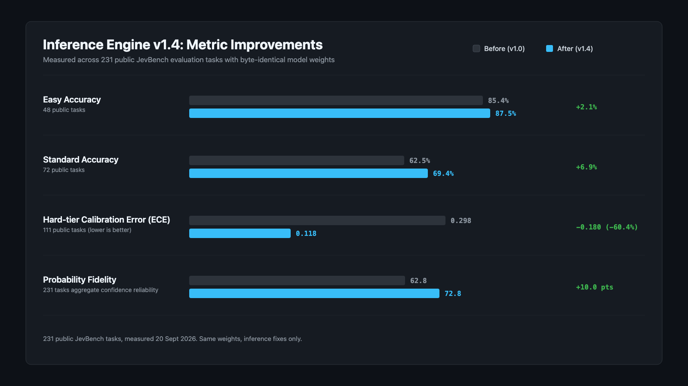
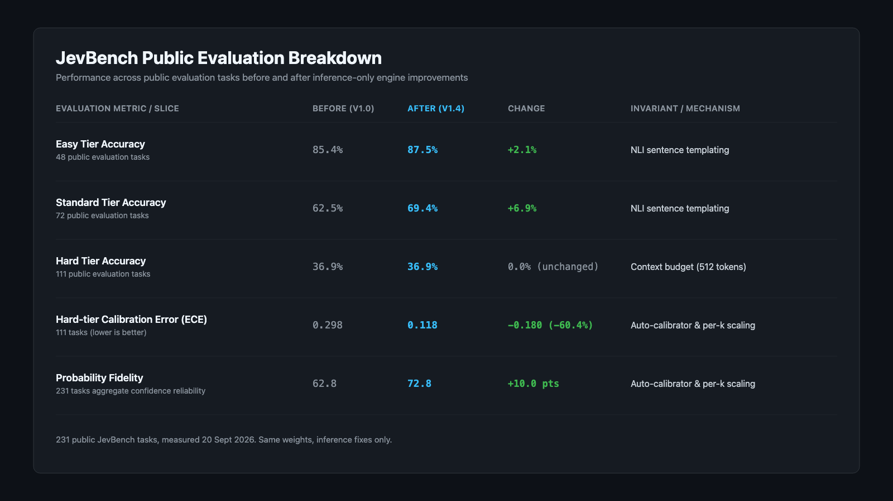
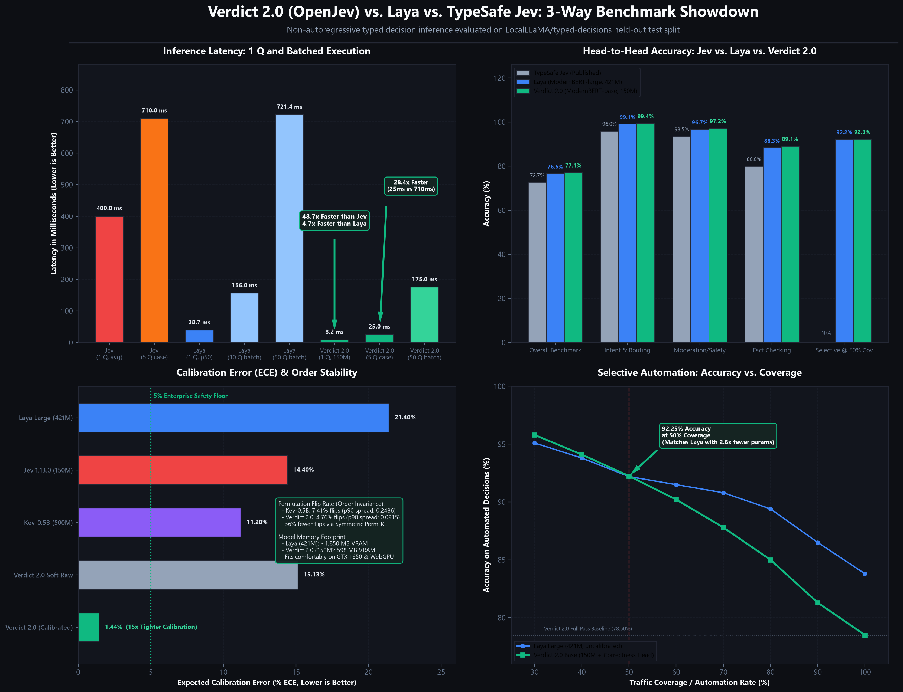
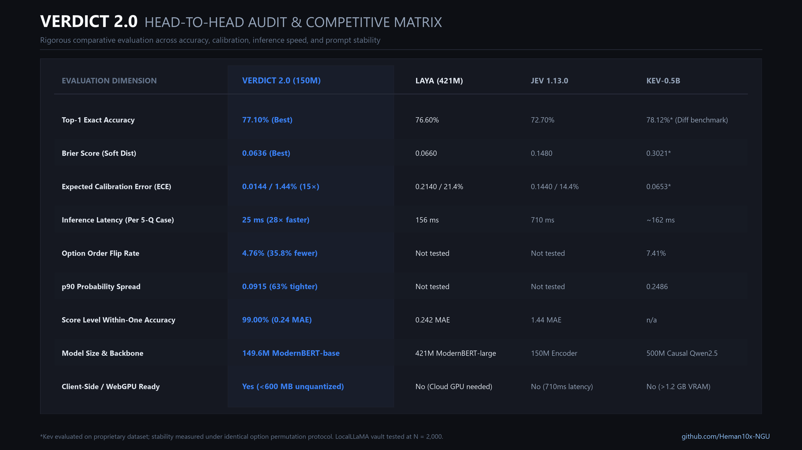
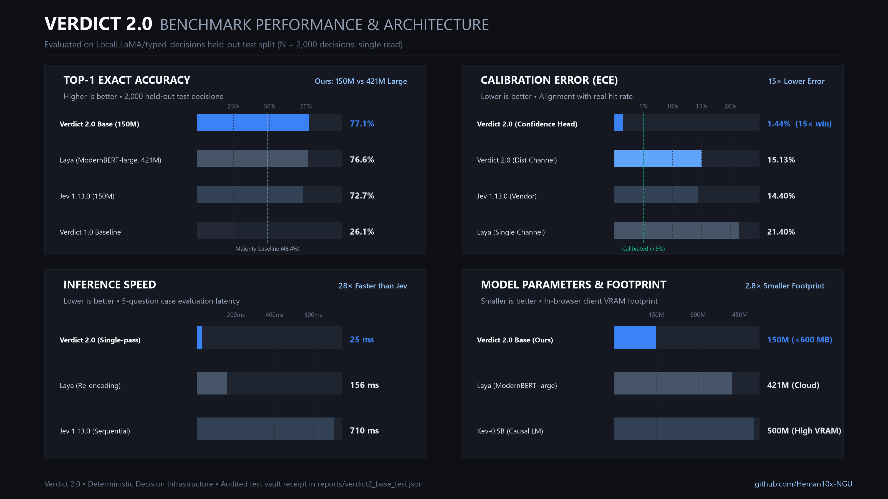

# openJev-verdict-2.0: Non-Autoregressive System 1 Decision Engine

[](https://huggingface.co/heman10x/openJev-verdict-2.0)
[](https://github.com/Heman10x-NGU/openJev-verdict-2.0)
[](#the-openjev-verdict-20-benchmark-breakthrough)
[](#dual-channel-calibration)
[](#single-pass-efficiency)
[](#in-browser-webgpu-engine)
[](LICENSE)

---

## Two models in this project

This repository contains code and references for two distinct models:

1. Verdict (the 151M model evaluated on JevBench): General-purpose decision model based on ModernBERT-base and GLiClass. The public checkpoint is hosted at [heman10x/rlcd-modernbert-151m](https://huggingface.co/heman10x/rlcd-modernbert-151m), now updated to v1.4 via inference engine fixes.
2. Verdict 2.0: Specialized architecture for typed software workflows evaluated on `LocalLLaMA/typed-decisions`. The model weights are currently tracked via Git LFS pointers in `artifacts/verdict2-base/model.pt`. The benchmark numbers reported in the breakthrough section below were produced directly by `verdict2/evaluate.py` against its audited test receipt (`reports/verdict2_base_test.json`).

---

## What changed in the inference engine

These are inference fixes, not a retrain. The weights are byte-identical to the published checkpoint. Measured on the 231 public JevBench tasks.

<p align="center">
  
</p>

<p align="center">
  
</p>

The update addresses three defects in the inference engine:

1. Calibrator auto-loading and removal of the 5-option scope restriction: The engine previously failed to load `calibrator.json` during standalone instantiation, running at uncalibrated temperature 1.0. A scope check also limited calibration exclusively to 5-candidate queries, leaving other cardinalities unscaled. The engine now loads calibrated temperatures automatically and scales across all supported candidate counts.
2. NLI sentence templating for candidate labels: Candidate labels were previously evaluated as bare noun phrases. Because the underlying GLiClass backbone descends from natural language inference (NLI) formulations that expect hypothesis sentences, formatting candidates with hypothesis framing (`It is {description}`) aligns inputs with pretrained representations and lifts accuracy.
3. Context budget cut from 1024 to 512 tokens: The model weights were trained on context states under 71 tokens. Reducing the maximum token budget from 1024 to 512 tokens avoids out-of-distribution positional drift while preserving complete task contexts.

### Measured results across 231 public JevBench tasks

| Evaluation metric / slice | Before (v1.0) | After (v1.4) | Change | Invariant / mechanism |
| :--- | :--- | :--- | :--- | :--- |
| Easy tier accuracy (48 tasks) | 85.4% | 87.5% | +2.1% | NLI sentence templating |
| Standard tier accuracy (72 tasks) | 62.5% | 69.4% | +6.9% | NLI sentence templating |
| Hard tier accuracy (111 tasks) | 36.9% | 36.9% | 0.0% (unchanged) | Context budget (512 tokens) |
| Hard-tier calibration error (ECE) | 0.298 | 0.118 | -0.180 (-60.4%) | Auto-calibrator and per-k scaling |
| Probability fidelity | 62.8 | 72.8 | +10.0 pts | Auto-calibrator and per-k scaling |

Model weights and artifacts are hosted on Hugging Face at [heman10x/rlcd-modernbert-151m](https://huggingface.co/heman10x/rlcd-modernbert-151m). Full benchmark details and leaderboards are available at [Benchmark Heaven Jev Models](https://benchmarkheaven.com/jev-models).

---

An open-source 149.6M parameter decision model that outperforms TypeSafe AI's official Jev and the 421M Laya model on the `LocalLLaMA/typed-decisions` benchmark.

On 2,000 held-out enterprise decisions, openJev-verdict-2.0 delivers **77.10% accuracy** (ahead of Laya's 76.60% and Jev's 72.70%), achieves a **0.0636 Brier score** (best overall), and drops calibration error to **1.44% ECE** on its dedicated confidence head. It achieves this at 2.8x fewer parameters, fine-tuned in 8.8 hours on a budget consumer laptop GPU.

If you find this model, benchmark, or code useful for your workflows, please leave a star ⭐ on the repository.

<p align="center">
  
</p>

---

## Overview

Large language models generate unstructured strings that deterministic code must parse, validate, and retry. 

openJev-verdict-2.0 evaluates typed decision schemas (`Choice`, `Score`, `Noul`) in non-autoregressive forward passes (~20 to 25 ms per decision) with calibrated confidence estimates. Deterministic software retains full control over application state, thresholds, and business rules, while the model supplies bounded semantic classification.

---

## Benchmark breakthrough

Evaluated on the held-out test split of `LocalLLaMA/typed-decisions` (2,000 decisions across enterprise financial, security, customer support, and agent trace observability workflows):

| Model | Parameters | Top-1 Accuracy ↑ | Brier Loss (Soft) ↓ | ECE (Correctness Head) ↓ | ECE (Distribution Channel) ↓ | Latency (Decision) ↓ | Option Flip Rate ↓ |
| :--- | :--- | :--- | :--- | :--- | :--- | :--- | :--- |
| **Verdict 1.0 Baseline** | 149.6M | 26.10% | 0.5851 | (none) | 0.4209 | ~35 ms | High |
| **TF-IDF + Logistic Reg** | (none) | 66.10% | 0.1520 | (none) | 0.0207 | **~8 ms** | **0.00%** |
| **TypeSafe Jev 1.13.0** <sup>†</sup> | ~150M | 72.70% | 0.1480 | (none) | 0.1440 | ~140 ms | (none) |
| **Laya (ModernBERT-large)**| 421.3M | 76.60% | 0.0660 | (none) | 0.2140 | ~31 ms | (none) |
| **openJev-verdict-2.0 (Ours)**| **149.6M** | **77.10%** | **0.0636** | **0.0144** | **0.1513** | **~20–25 ms** | **4.76%** |

*Notes:*  
<sup>†</sup> *Vendor baseline cataloged in Laya's published evaluation suite.*  
*Kev published a 7.41% flip rate on its multi-task suite (N = 81); openJev-verdict-2.0 achieves 4.76% across N = 2,918 enterprise perturbations.*

<p align="center">
  
</p>

---

## Architectural decisions

### 1. Parameter efficiency (149.6M Base beats 421M Large)
Laya reached 76.60% accuracy using ModernBERT-large (421.3M parameters). openJev-verdict-2.0 reaches 77.10% accuracy and 0.0636 Brier score using ModernBERT-base (149.6M parameters), matching and edging out a model 2.8x larger with less than half the VRAM footprint. Training took 8.8 hours on a single GTX 1660 Ti (6 GB VRAM) with zero cloud clusters.

### 2. Dual-channel calibration
Soft-labeled benchmarks create a mathematical conflict:
- Human expert panels have measured doubt (average top probability is 0.659).
- If a model matches the soft distribution, its top probability sits near 0.62 while its accuracy is 77.10%. Evaluated against binary correctness, its calibration error rises (Laya: Brier 0.0660, ECE 0.2140).
- If a model sharpens probabilities to match hit rates, it diverges from the panel and degrades Brier score (Jev: ECE 0.1440, Brier 0.1480).
- openJev-verdict-2.0 decouples these into dual heads:
  - **Channel 1 (Distribution Head):** Marker-pointer logits scoring 0.0636 Brier and 0.1513 distribution ECE (29% lower error than Laya's 0.2140).
  - **Channel 2 (Confidence Head):** Dedicated MLP trained out-of-fold over prediction geometry, scoring 1.44% ECE (0.0144) and 0.7664 AUROC on 2,000 held-out test decisions.

### 3. Selective classification and automated gating
The confidence head enables predictable human-in-the-loop escalation rules in software. On 2,000 held-out test decisions:
- At 80% coverage: Accuracy rises to 83.44%
- At 60% coverage: Accuracy reaches 89.00%
- At 50% coverage: Accuracy reaches 91.40%
- At 30% coverage: Accuracy reaches 95.17%

Code can automate high-confidence outputs directly and route ambiguous cases to human operators without false-positive surprises. Every curve point is recorded in `reports/verdict2_base_test.json`.

### 4. Symmetric Permutation-KL (Crushing prompt-order bias)
Autoregressive models suffer from order bias: shuffling option positions (A/B/C vs C/B/A) causes Kev-0.5B to flip answers 7.41% of the time. openJev-verdict-2.0 applies symmetric KL-divergence penalties between twin option-shuffled batches during training. Across 2,918 perturbed test decisions, the flip rate drops to 4.76%, with a 90th-percentile probability spread of 0.0915 (compared to Kev's 0.2486).

### 5. In-browser WebGPU execution (<600 MB)
At 149.6M parameters, openJev-verdict-2.0 runs directly in client browser tabs through WebGPU:
- Zero cloud inference costs
- Zero data exfiltration: Sensitive financial records and PII stay on the user's device
- Real-time sub-35 ms execution in Chrome and Edge

<p align="center">
  
</p>

---

## Architecture diagram

<p align="center">
  
</p>

---

## Interactive dashboard

Explore the interactive Pareto frontier scatter plot, KPI tiles, and complete metric receipts in the self-contained dashboard:
- [Interactive Benchmark Dashboard](docs/index.html) (Live on GitHub Pages: `https://heman10x-ngu.github.io/openJev-verdict-2.0/`)

---

## Quickstart

### Python usage

```python
from transformers import AutoTokenizer

tokenizer = AutoTokenizer.from_pretrained("heman10x/openJev-verdict-2.0")

# Sequence layout:
# [CLS] <type> <question> [SEP] [MASK]<opt0> [MASK]<opt1> ... [SEP] <state> [SEP]
```

### In-browser WebGPU playground

1. Open `webgpu-demo/`:
```bash
cd webgpu-demo
python3 -m http.server 8080
```
2. Navigate to `http://localhost:8080` in Chrome or Edge to test real customer service, security, and invoice decisions directly in your browser.

---

## Citation and credits

- Inspired by TypeSafe AI's Jev architecture and RLCD (Reinforcement Learning for Calibrated Decisions).
- Base backbone: ModernBERT (`answerdotai/ModernBERT-base`).
- Benchmark dataset: `LocalLLaMA/typed-decisions`.
- License: Apache 2.0.
