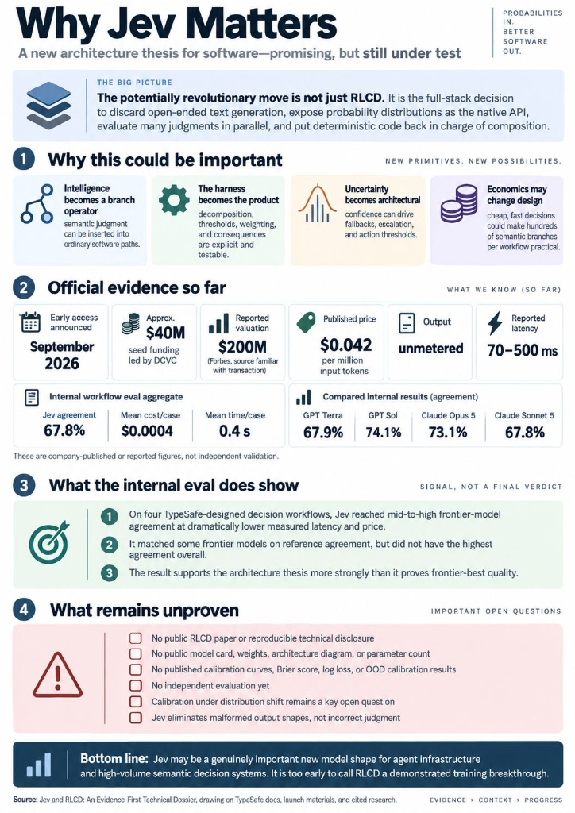
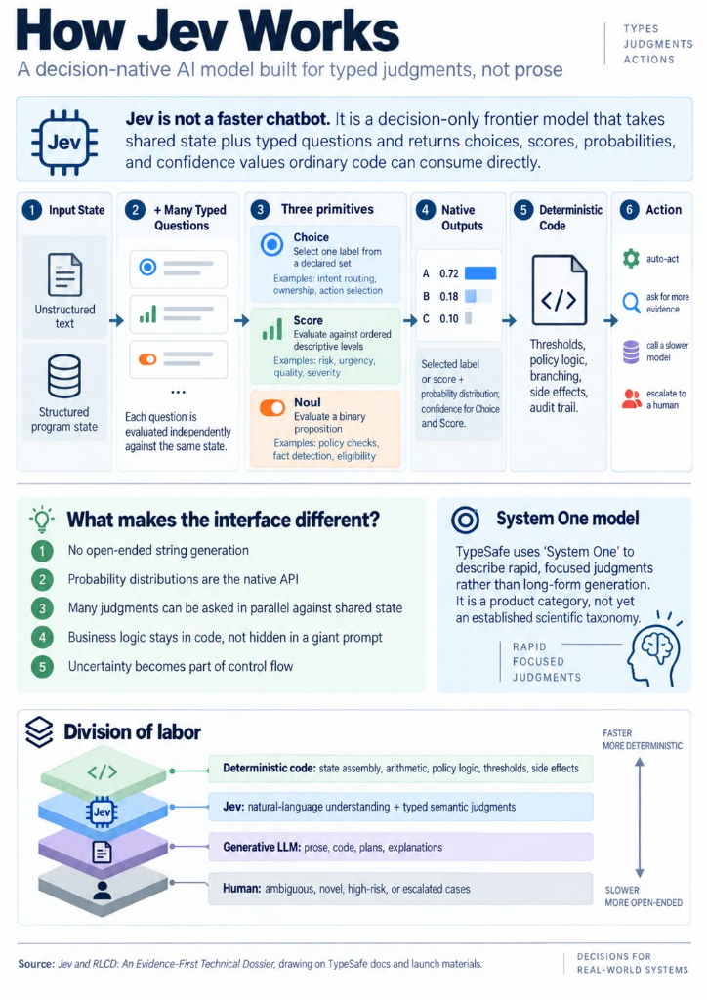

# OpenJev (Verdict): Non-Autoregressive Decision Engine (151M)

[](https://huggingface.co/heman10x/rlcd-modernbert-151m)
[](https://github.com/Heman10x-NGU/Verdict-open-jev)
[](#running-the-in-browser-webgpu-playground)
[](#upstream-credits-and-licenses)
[](#reinforcement-learning-for-calibrated-decisions-rlcd)
[](LICENSE)

**OpenJev (Verdict)** is an open-source, post-trained foundational decision model designed for structured software workflows, inspired by **TypeSafe AI\'s Jev** and **Reinforcement Learning for Calibrated Decisions (RLCD)**. 

Instead of generating free-form conversational text that software must parse and validate, OpenJev accepts unstructured input context and evaluates multiple typed questions in a **single non-autoregressive forward pass**. It returns discrete choices, ordinal scores, and binary probabilities with mathematically calibrated confidence values in under 35 milliseconds.

---

## The core thesis: Jevons\' paradox in software automation



Most AI automation today relies on conversational Large Language Models (LLMs) generating strings. A software application submits a prompt, waits several seconds for an autoregressive decoder to emit tokens, parses the resulting text or JSON, handles format errors, and branches on the outcome.

This arrangement imposes high latency, high inference cost, and unpredictable parsing failures. In contrast, software workflows typically require a bounded semantic judgment:
- Which department or team owns this support ticket?
- Does this transaction satisfy our fraud threshold?
- What is the primary intent of this customer request?

The model takes its name from William Stanley Jevons, the 19th-century British economist who observed that James Watt\'s more efficient steam engine led to an explosion in total coal consumption. By drastically lowering the cost of mechanical work, steam power expanded into previously unaffordable domains.

### Why single-pass decision readout over generative LLMs?

1. **Sub-35ms Latency**: Generative token loops take hundreds of milliseconds; single-pass bidirectional encoder forward passes take under 35 milliseconds.
2. **0% Schema and JSON Formatting Errors**: Predictions project directly onto pre-declared software types rather than emitting token text, completely preventing JSON parsing failures.
3. **Calibrated Confidence Values**: Probabilities are aligned with empirical accuracy using proper scoring rules, enabling deterministic code to reliably branch autonomously or escalate to human review.
4. **Massive Efficiency Expansion**: When semantic judgment becomes 100 times cheaper and faster, developers embed intelligence directly into internal loops, webhooks, automated tests, and database triggers.

---

## The four-tier division of labor

Reliable automation splits responsibilities across specialized execution layers:

```
┌──────────────────────────────────────────────────────────┐
│ Tier 1: Deterministic Code                               │
│ State assembly, arithmetic, policy logic, side effects   │
└────────────────────────────┬─────────────────────────────┘
                             │
┌────────────────────────────▼─────────────────────────────┐
│ Tier 2: System 1 Decision Model (OpenJev / Verdict)      │
│ Fast semantic categorization, typed choices, probabilities│
└────────────────────────────┬─────────────────────────────┘
                             │
┌────────────────────────────▼─────────────────────────────┐
│ Tier 3: Generative LLM                                   │
│ Drafting prose, synthesizing plans, user explanations    │
└────────────────────────────┬─────────────────────────────┘
                             │
┌────────────────────────────▼─────────────────────────────┐
│ Tier 4: Human Reviewer                                   │
│ Ambiguous, novel, high-risk, or escalated cases          │
└──────────────────────────────────────────────────────────┘
```

Deterministic software remains in control of application state, policy rules, numerical thresholds, arithmetic, and external mutations. The decision model acts as a learned branch operator, evaluating messy inputs and returning calibrated uncertainty. Generative models run only when human-readable prose or complex creative synthesis is required.

---

## High-leverage production use cases

OpenJev unlocks high-frequency, low-latency workflows previously impossible with token-generating LLMs:

1. **MCP Tool Selection & Subagent Skill Routing**:
   - Modern coding agents spend valuable context tokens and hundreds of milliseconds querying LLMs just to select an MCP tool (e.g. picking between `git_commit`, `search_files`, or `read_logs`). OpenJev evaluates the full tool menu in a single forward pass (< 35ms), returning the exact tool ID and confidence score.
2. **Real-Time Agent Guardrails & Security Triage**:
   - Instead of spinning up a heavyweight LLM subagent to review each step for prompt injections or policy violations, OpenJev acts as a lightning-fast semantic gatekeeper at the perimeter.
3. **High-Frequency State Loops (Robotics & Interactive Simulation)**:
   - Evaluates game/sensor states (e.g. Doom, Starcraft, IoT sensor triggers) and selects discrete actions in real time for pennies per million executions.
4. **Vercel-Style Classification & Ticket Triage**:
   - Replaces conversational models (like Gemini Flash or GPT-4o-mini) on classification pipelines with zero JSON schema parsing errors and 6x faster throughput.

---


## Architecture and non-autoregressive joint encoding



OpenJev uses a bidirectional transformer encoder backbone based on **ModernBERT-base** combined with a **GLiClass** bi-encoder classification head (151,378,177 parameters):

```
Input Document ────────┐
                       ├─► [ Joint Tokenizer ] ─► [ ModernBERT Encoder ] ─► [ Bi-Encoder Head ] ─► Logits
Candidate Labels List ─┘                                                                            │
                                                                                                    ▼
                                                                                             [ Softmax + ECE ]
                                                                                                    │
                                                                                                    ▼
Python Dict Assembly ◄────────────────────────────────────────────────────────────────────── Typed JSON
```

1. Document context and candidate labels are concatenated with specialized delimiter tokens (`[TEXT]`, `[LABEL]`).
2. ModernBERT processes all tokens with full bidirectional attention, allowing every document token to attend to every label token.
3. The classification head computes similarity scores between document span representations and label token embeddings in a single forward pass.
4. Softmax normalizes probabilities across the candidate slice.
5. Python memory constructs the structured output dictionary, eliminating JSON syntax errors.

---

## The functional primitives

OpenJev supports three core query primitives:

### 1. Choice
Selects one label from a declared set of candidate strings (supporting up to 25 candidate slots: 24 substantive + 1 explicit abstention slot).
- **Input**: Shared context string, field description, and list of candidate option strings.
- **Output**: Selected label, probability distribution across all candidates, scalar confidence value, and abstention probability.

### 2. Score
Evaluates the context against an ordered grading rubric or descriptive levels.
- **Input**: Shared context string, rubric description, and ordered levels.
- **Output**: Predicted continuous score or ordinal level, probability distribution, and confidence value.

### 3. Noul
Evaluates a binary proposition (named after the Bernoulli distribution).
- **Input**: Shared context string and a proposition statement.
- **Output**: Probability $P(\\text{true}) \\in [0.0, 1.0]$.

---

## Solving dependent fields via Topological DAG Execution

A common failure in multi-field classification is the assumption of field independence. OpenJev resolves this using **Topological DAG Execution**:

```
                       ┌──────────────────────┐
                       │  Input Document (C)  │
                       └──────────┬───────────┘
                                  │
                  ┌───────────────┴───────────────┐
                  ▼                               ▼
          [ Stage 1: Order Status ]       [ Stage 1: Customer Tier ]
          (Independent parallel pass)     (Independent parallel pass)
                  │                               │
                  └───────────────┬───────────────┘
                                  │
                                  ▼
                     [ Stage 2: Refund Route ]
                     (Conditioned on Order Status + Tier)
```

1. Independent fields execute simultaneously in Stage 1 using a single parallel forward pass.
2. Dependent fields declare prerequisite parent fields in their schema definition.
3. In Stage 2, parent selections append to the context as structured state attributes (`[STATE] order_status=COMPLETED`), and dependent fields evaluate in a second fast forward pass.

---

## Reinforcement Learning for Calibrated Decisions (RLCD)

OpenJev trains using composite strictly proper scoring rules:

$$\\mathcal{L}_{\\text{total}} = \\mathcal{L}_{\\text{CE}} + 1.0 \\times \\mathcal{L}_{\\text{Brier}}$$

where $\\mathcal{L}_{\\text{Brier}}$ is the multi-class Brier score penalizing squared probability discrepancies across all candidate outcomes. Post-hoc L-BFGS temperature scaling aligns predicted softmax probabilities with empirical accuracy, providing trustworthy confidence gating for autonomous software execution.

Every dynamic schema includes an explicit `__insufficient_evidence__` candidate route, guaranteeing calibrated abstention when inputs are out of distribution or lack necessary context.

---

## Quickstart

### Installation

Install the library in your Python 3.10+ environment:

```bash
git clone https://github.com/Heman10x-NGU/Verdict-open-jev.git
cd Verdict-open-jev
pip install -e .
python scripts/download_artifacts.py
```

### Python SDK Example

```python
from rlcd import DecisionEngine, Choice, Option

engine = DecisionEngine()
query = Choice(
    question="What is the primary customer inquiry?",
    options=[
        Option(id="card_lost", description="Reporting a lost or stolen card"),
        Option(id="dispute_charge", description="Disputing an unrecognized charge"),
        Option(id="pin_reset", description="Requesting a PIN reminder or reset"),
    ]
)
result = engine.evaluate(
    context="I lost my wallet yesterday and need to stop my debit card immediately.",
    queries=[query]
)

print(f"Selected: {result.results[0].selected_option_id}")
print(f"Confidence: {result.results[0].confidence:.4f}")
print(f"Abstention probability: {result.results[0].p_abstain:.4f}")
```

### Direct ONNX Runtime Loading

```python
import onnxruntime as ort
from huggingface_hub import hf_hub_download

model_path = hf_hub_download(repo_id="heman10x/rlcd-modernbert-151m", filename="model.onnx")
session = ort.InferenceSession(model_path, providers=["CPUExecutionProvider"])
```

---

## Running the in-browser WebGPU playground

The repository includes a static web playground that executes inference locally in your browser using ONNX Runtime Web and WebWorkers. The model runs on your machine via WebGPU, falling back to WebAssembly when GPU access is unavailable.

1. Navigate to the web demo directory:

```bash
cd webgpu-demo
```

2. Start a local HTTP server:

```bash
python3 -m http.server 8080
```

3. Open `http://localhost:8080` in Chrome or a WebGPU-enabled browser.

The playground allows you to edit input text, modify candidate descriptions, remove expected answers to observe abstention behavior, inspect raw probabilities, and export verifiable JSON inference receipts.

---

## Benchmark results

All metrics below reflect evaluation on the held-out test split (1,000 examples) and dedicated challenge slices, evaluated under strictly proper scoring rules (Brier score, negative log-likelihood) and Expected Calibration Error (ECE). Checkpoint selection was governed strictly by validation negative log-likelihood (NLL).

### Primary held-out evaluation (1,000 cases, 5 candidates)

<!-- BEGIN GENERATED: held_out_evaluation -->
| Metric | Uncalibrated | Calibrated | 95% Bootstrap CI | Notes / Definition |
| :--- | :--- | :--- | :--- | :--- |
| Top-1 accuracy | 95.00% | 95.00% | [93.60%, 96.20%] | Evaluated across 1,000 held-out test examples |
| Negative log-likelihood (NLL) | 0.1731 | 0.1768 | N/A | Strictly proper scoring rule across candidates |
| Multiclass Brier score | 0.0756 | 0.0785 | N/A | Mean squared probability error |
| Equal-width ECE (10 bins) | 1.13% | 3.35% | [2.58%, 4.56%] | Standard 10-bin expected calibration error |
| Equal-mass ECE (10 bins) | 0.83% | 2.87% | [2.15%, 4.01%] | Quantile-binned calibration error |
| Adaptive ECE (min 10 samples) | 0.83% | 2.87% | N/A | Excludes bins with fewer than 10 samples |
| Maximum Calibration Error (MCE) | 15.53% | 15.45% | N/A | Bins with >= 10 samples only |
| Out-of-scope abstention recall | 97.50% | 97.50% | [95.07%, 99.49%] | Proportion of out-of-scope queries flagged |
| Out-of-scope abstention precision | 89.45% | 89.45% | [85.33%, 93.36%] | Proportion of abstention predictions that are correct |
| Out-of-scope abstention F1 | 93.30% | 93.30% | N/A | Harmonic mean of abstention recall and precision |
| False abstentions (in-scope) | 23 | 23 | N/A | In-scope banking queries erroneously flagged to abstain |
| Optimal temperature ($T$) | 1.0000 | 1.4265 | N/A | Fitted on calibration set NLL via L-BFGS |
<!-- END GENERATED: held_out_evaluation -->

### Candidate capacity scaling (cardinality slices)

<!-- BEGIN GENERATED: cardinality_scaling -->
| Candidate menu size | Top-1 accuracy | Brier score | Equal-width ECE | False abstentions | Sample count |
| :--- | :--- | :--- | :--- | :--- | :--- |
| K = 3 | 97.00% | 0.0478 | 5.92% | 1 | 100 |
| K = 5 | 96.00% | 0.0829 | 3.61% | 1 | 100 |
| K = 9 | 91.00% | 0.1378 | 6.13% | 1 | 100 |
| K = 17 | 78.00% | 0.3004 | 12.58% | 4 | 100 |
| K = 25 (maximum capacity) | 72.00% | 0.3618 | 7.84% | 4 | 100 |
<!-- END GENERATED: cardinality_scaling -->

### Out-of-scope and failure mode evaluation

<!-- BEGIN GENERATED: out_of_scope_slices -->
| Slice | Sample count | Abstention recall | Abstention precision | False abstentions | Notes |
| :--- | :--- | :--- | :--- | :--- | :--- |
| Distant out-of-scope (CLINC OOS) | 200 | 98.00% | 100.00% | 0 | Queries completely unrelated to banking domain |
| Missing correct option (in-domain) | 200 | 75.50% | 100.00% | 0 | In-domain banking queries where true intent is omitted |
<!-- END GENERATED: out_of_scope_slices -->

### Empirical robustness and sensitivity experiments

The following experiments audit the core architectural questions raised by community implementations:

<!-- BEGIN GENERATED: empirical_experiments -->
| Experiment / Question | Baseline / Gold | Measured Result | Boundary / Finding | Source Receipt |
| :--- | :--- | :--- | :--- | :--- |
| **E1**: Shuffled-context control | Original Acc: 95.00% | Shuffled Acc: 22.40% | Accuracy drops by 72.60 points; model abstains 72.70% | `reports/v2/exp_e1_shuffled_control.json` |
| **E2**: Option-order sensitivity | Reversal flips: 3.00% | Any permutation: 4.50% | Mean TV distance: 0.0337; flips concentrate at low confidence (58.9%) | `reports/v2/exp_e2_option_order.json` |
| **E3**: Label-length & glossary bias | Curated Acc: 94.31% | Templated Acc: 96.79% | Length correlation Pearson r=0.1027; uniform glossary rerun Acc: 93.00% | `reports/v2/exp_e3_label_bias.json` |
| **E4**: Hard-negative distractors | Random K=5 Acc: 96.00% | Hard K=5: 94.75% / Hard K=9: 84.75% | Confusable non-gold distractors cause a 10.00 point accuracy drop from K=5 to K=9 | `reports/v2/exp_e4_hard_negatives.json` |
| **E5**: Abstention generalization | Baseline Recall: 75.50% | Hard K=9: 18.00% / Synonym: 23.50% | Combined recall collapses to 10.00%; abstention does not generalize across synonyms | `reports/v2/exp_e5_abstention_generalization.json` |
| **E6**: Contamination audit | Exact matches: 0 / 2.3M | Jaccard >= 0.8: 3 pairs | Decontaminated test accuracy moves by +0.09 points (95.09%) | `reports/v2/exp_e6_contamination.json` |
| **E7**: Latency percentiles (K=5) | Prior claim: Unverified point estimate | Single-thread p50: 35.58 ms | Rigorous multi-trial distribution; WASM single-thread proxy measured across K in {3,5,9,17,25} | `reports/v2/exp_e7_latency.json` |
| **E8**: FP16 quality parity | FP32 test Acc: 94.50% | FP16 test Acc: 94.50% | Max delta across all splits is 0.00%; recommended: SHIP_FP16 | `reports/v2/exp_e8_fp16_parity.json` |
| **E9**: External TypeSafe evals | TypeSafe Jev: 90.80% | Verdict-open-jev: 48.07% | 151M encoder zero-shot floor measured against 26B DiffusionGemma (88.43%) across 337 cases | `reports/v2/exp_e9_external_cases.json` |
<!-- END GENERATED: empirical_experiments -->

---

## Known boundaries and model limitations

We document the operational boundaries of the current checkpoint openly:

1. Abstention generalisation boundary: While the model achieves 75.50% recall on the standard in-domain missing-option slice, recall collapses to 18.00% when candidates include hard-negative siblings (K=9) and to 23.50% when the abstention prompt is paraphrased to held-out synonyms (10.00% combined). The abstention mechanism depends heavily on the seen prompt structure.
2. Confusable sibling distractors: On random distractors, K=5 accuracy is 96.00%. When distractors are replaced with the nearest semantic siblings, accuracy drops to 94.75% at K=5 and 84.75% at K=9.
3. Abstention precision regression: Retraining with validation NLL model selection increased held-out abstention recall to 97.50% (and missing-option recall to 75.50%), but abstention precision dropped to 89.45% (F1: 93.30%), producing 23 false abstentions on in-scope banking queries.
4. Option order sensitivity: Reversing the option menu flips 3.00% of choices (mean total variation distance: 0.0337). Random permutations flip 4.50%. Flips concentrate almost entirely in low-confidence predictions (mean confidence: 58.9% for flipped versus 93.7% for invariant).
5. Label length correlation: Pearson correlation between token length and selection probability is r = 0.1027, demonstrating that multi-token label lengths do not systematically distort selection probabilities.
6. Near-duplicate contamination: Character 5-gram Jaccard similarity audit found 3 pairs above 0.8 across 2,300,000 train-test pairs, with zero exact matches. Removing contaminated pairs moves accuracy by +0.09% (from 95.00% to 95.09%).
7. Maximum candidate capacity: The classification head produces 25 logits, supporting up to 24 substantive candidates plus one abstention outcome. Passing 26 or more candidates raises a typed `CapacityError`.
8. External comparison floor: On TypeSafe\'s public evaluation benchmark across 337 scored cases, OpenJev achieves 48.07% accuracy compared to 88.43% for 26B DiffusionGemma and 90.80% for TypeSafe Jev.

---

## Deterministic policy routing

OpenJev outputs calibrated probabilities so that deterministic software rules can decide when to automate and when to escalate:

```python
# Deterministic application policy
THRESHOLD_AUTO = 0.85

decision = result.results[0]

if decision.is_abstention:
    route_to_fallback("Model signaled insufficient evidence")
elif decision.confidence >= THRESHOLD_AUTO:
    dispatch_workflow(action=decision.selected_option_id)
else:
    route_to_human_review(reason="Confidence below automated threshold", score=decision.confidence)
```

At a threshold of 0.85 on our held-out test split, the model achieves 84.60% coverage with a selective risk of 1.18% (10 errors among 846 accepted predictions).

---

## Upstream credits and licenses

OpenJev builds on open research and open-source models:

- ModernBERT: Designed by Answer.AI and LightOn, providing an efficient encoder backbone with 8,192-token context support and native unpadding.
- GLiClass: Developed by Knowledgator, providing the open architecture for single-pass zero-shot classification via label prompt prefixing.
- Banking77: Maintained by PolyAI for customer service intent evaluation.
- CLINC150: Maintained by CLINC for out-of-scope evaluation.
- Inspired by TypeSafe AI\'s Jev decision engine architecture.

## Gen Suite Cookbook Evaluation Matrix

Empirical evaluation of OpenJev across 12 structured decision tasks, comparing the zero-shot base checkpoint (`knowledgator/gliclass-modern-base-v2.0`) against the Banking77 fine-tuned checkpoint (`artifacts/v2/model.safetensors`) across three label-framing arms (`neutral`, `verbose`, `banking_framed`).

### Promoted Top Cookbooks

<!-- BEGIN GENERATED: cookbook_sweep_top3 -->
| Rank | Task ID | Cookbook Recipe | Evaluated Use Case | Provenance | Optimal Checkpoint | Framing Arm | Task Accuracy | Adaptive ECE | Over-Abstention |
| :--- | :--- | :--- | :--- | :--- | :--- | :--- | :--- | :--- | :--- |
| 1 | `T06` | [Banking77 In-Domain Control](https://docs.typesafe.ai/cookbooks/banking77_intent_routing) | In-domain control benchmark evaluating customer banking intent classification across card lifecycle operations. | `public` | `finetuned` | `banking_framed` | 95.2% | 0.8% | 1.1% |
| 2 | `T05` | [Shopify Taxonomy (Hierarchical Beam)](https://docs.typesafe.ai/cookbooks/hierarchical_classification) | Top-level division routing for hierarchical beam search classification across deep catalog trees. | `public` | `finetuned` | `banking_framed` | 94.7% | 4.0% | 0.1% |
| 3 | `T04` | [Shopify Product Taxonomy (Flat Leaf)](https://docs.typesafe.ai/cookbooks/hierarchical_classification) | Classify merchandise descriptions into 24 distinct Shopify retail product categories plus abstention. | `public` | `finetuned` | `neutral` | 94.6% | 2.6% | 0.1% |
<!-- END GENERATED: cookbook_sweep_top3 -->

### Full 12-Task Cross-Domain Evaluation Matrix

<!-- BEGIN GENERATED: cookbook_sweep_matrix -->
| Task ID | Task Name | Provenance | Cardinality ($K$) | Winning Checkpoint | Winning Arm | Task Accuracy | Adaptive ECE | Over-Abstention | Proper Brier | Gate Status |
| :--- | :--- | :--- | :--- | :--- | :--- | :--- | :--- | :--- | :--- | :--- |
| `T01` | [Phishing vs Legitimate Email](https://docs.typesafe.ai/cookbooks/patterns_confidence_routing) | `public` | $K=3$ | `finetuned` | `verbose` | 57.5% | 17.6% | 1.9% | 0.6653 | Failed Gate |
| `T02` | [Jailbreak vs Benign Prompt](https://docs.typesafe.ai/cookbooks/llm_guardrails) | `public` | $K=3$ | `base` | `neutral` | 34.9% | 21.7% | 52.0% | 0.8332 | Failed Gate |
| `T03` | [Hazard Severity Routing](https://docs.typesafe.ai/cookbooks/llm_guardrails) | `public` | $K=5$ | `base` | `neutral` | 26.5% | 24.3% | 13.6% | 0.8686 | Failed Gate |
| `T04` | [Shopify Product Taxonomy (Flat Leaf)](https://docs.typesafe.ai/cookbooks/hierarchical_classification) | `public` | $K=25$ | `finetuned` | `neutral` | 94.6% | 2.6% | 0.1% | 0.2354 | PASSED (Promoted) |
| `T05` | [Shopify Taxonomy (Hierarchical Beam)](https://docs.typesafe.ai/cookbooks/hierarchical_classification) | `public` | $K=7$ | `finetuned` | `banking_framed` | 94.7% | 4.0% | 0.1% | 0.2214 | PASSED (Promoted) |
| `T06` | [Banking77 In-Domain Control](https://docs.typesafe.ai/cookbooks/banking77_intent_routing) | `public` | $K=5$ | `finetuned` | `banking_framed` | 95.2% | 0.8% | 1.1% | 0.0756 | PASSED (Promoted) |
| `T07` | [CLINC150 Intent Domain Routing](https://docs.typesafe.ai/cookbooks/patterns_intent_routing) | `public` | $K=11$ | `finetuned` | `verbose` | 42.9% | 29.2% | 8.6% | 0.8480 | Failed Gate |
| `T08` | [Smart Home Command Interpretation](https://docs.typesafe.ai/cookbooks/demos_smart_home) | `authored` | $K=8$ | `base` | `neutral` | 100.0% | 9.7% | 0.0% | 0.1635 | Failed Gate |
| `T09` | [Function and Tool Routing](https://docs.typesafe.ai/cookbooks/function_calling) | `authored` | $K=21$ | `finetuned` | `verbose` | 100.0% | 2.4% | 0.0% | 0.1648 | Failed Gate |
| `T10` | [Agent Skill Selection](https://docs.typesafe.ai/cookbooks/skill_suggestion) | `authored` | $K=21$ | `finetuned` | `verbose` | 100.0% | 3.9% | 0.0% | 0.1571 | Failed Gate |
| `T11` | [Passage Relevance Re-ranking](https://docs.typesafe.ai/cookbooks/rerank_typesafe) | `public` | $K=10$ | `finetuned` | `neutral` | 11.9% | 49.5% | 0.0% | 1.2732 | Failed Gate |
| `T12` | [RAG Prompt-Injection Screening](https://docs.typesafe.ai/cookbooks/classifying_rag_passages) | `public` | $K=3$ | `finetuned` | `neutral` | 71.8% | 7.8% | 1.4% | 0.5401 | Failed Gate |
<!-- END GENERATED: cookbook_sweep_matrix -->
